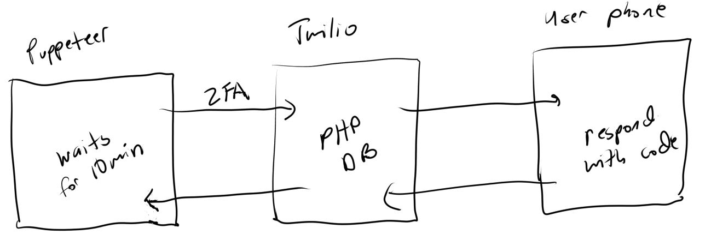

### About
This shows how to use Puppeteer to login to your finances and extract data such as the acct balance. Then send it to a Google spreadsheet. This also shows a solution to handling 2FA using Twilio as the bridge between the automated script and the user. In my case I used Twilio since I don't have any mobile apps that I've written with pub-sub events like push notifications. So I've been using Twilio as an app by Android SMS.

See the demonstration below:

Above the `call api #` calls is the BofA script waiting for the SMS 2FA value. I get a heads up from the `SM###...` line which is from a Twilio sms sent to myself. Once I receive the BofA sms I then send that to the Twilio API which then provides it for the `call api #` request. Then the login script continues by entering that value into the 2FA prompt and logs in. Then gets the balance and sends it to Google spreadsheet.

You can just directly use Twilio as your 2FA number but chances are you use your own phone number and also this is a weird way to do this. Better to use some kind of app but I haven't made one yet. Closest I could get is a PWA with web workers or web socket with push notifications.

### Workflow
Below is a graphic on how the workflow is setup.

### How to use
At the bare minimum you would have to go into the `puppeteer` folder and do `npm install`.

This repo only shows one example(for BofA current web UI as of 03/07/2021). For any other account you'd have to make your own. I'm not sharing mine for obvious reasons unfortunately. I am manually finding `DOM` elements and values vs. a faster way like through a point-click Chrome extension.

Note that in order for the 2FA part to work you would have to have your own Twilio setup running and the API [here](https://github.com/jdc-cunningham/puppeteer-finance-balance-automation/blob/master/twilio-2fa-api/index.js#L108) has to be running as well.

This is my current Twilio endpoint that's receiving all my Twilio text messages. I just added a conditional branch in here to forward it to a new url for the API mentioned above(in this repo). Then I parse it for the string matching eg. `bofa: ######`. If there is an authcode, it's saved into the API's db and then that request that's waiting above can get it.

### More info

See my writeup on [medium](https://jdc-cunningham.medium.com/automating-my-finances-with-puppeteer-47bf2563fec0) here about this project.
