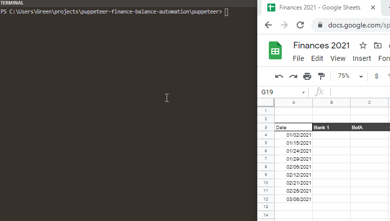

### About
This shows how use Puppeteer to login to your finances and extract data such as the acct balance. Then send it to a Google spreadsheet. This also shows a solution to handling 2FA using Twilio as the bridge between the automated script and the user. In my case I used Twilio since I don't have any mobile apps that I've written with pub-sub events like push notifications. So I've been using Twilio as an app by Android SMS.

See the demonstration below:

Above the `call api #` calls is the BofA script waiting for the SMS 2FA value. I get a heads up from the `SM###...` line which is from a Twilio sms sent to myself. Once I receive the BofA sms I then send that to the Twilio API which then provides it for the `call api #` request. Then the login script continues by entering that value into the 2FA prompt and logs in. Then gets the balance and sends it to Google spreadsheet.

You can just directly use Twilio as your 2FA number but chances are you use your own phone number and also this is a weird way to do this. Better to use some kind of app but I haven't made one yet. Closest I could get is a PWA with web workers or web socket with push notifications.